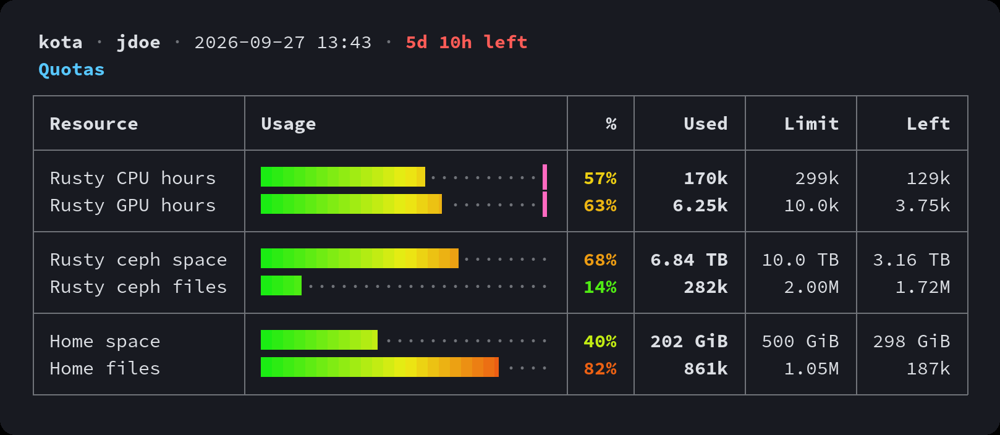

# kota

Flatiron cluster quotas at a glance.



```sh
git clone https://github.com/iSach/kota && kota/install.sh
```

```
kota      quotas
kota -g   GPU hours by type
kota -d   ceph directories
```
